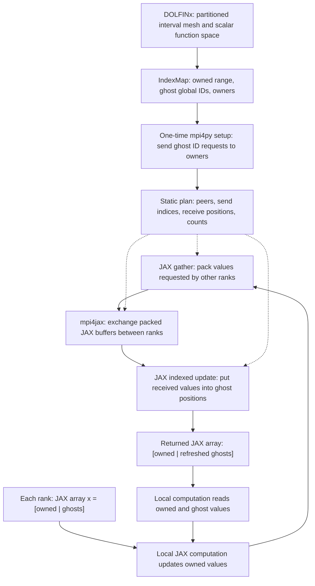
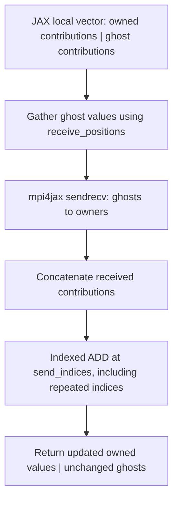
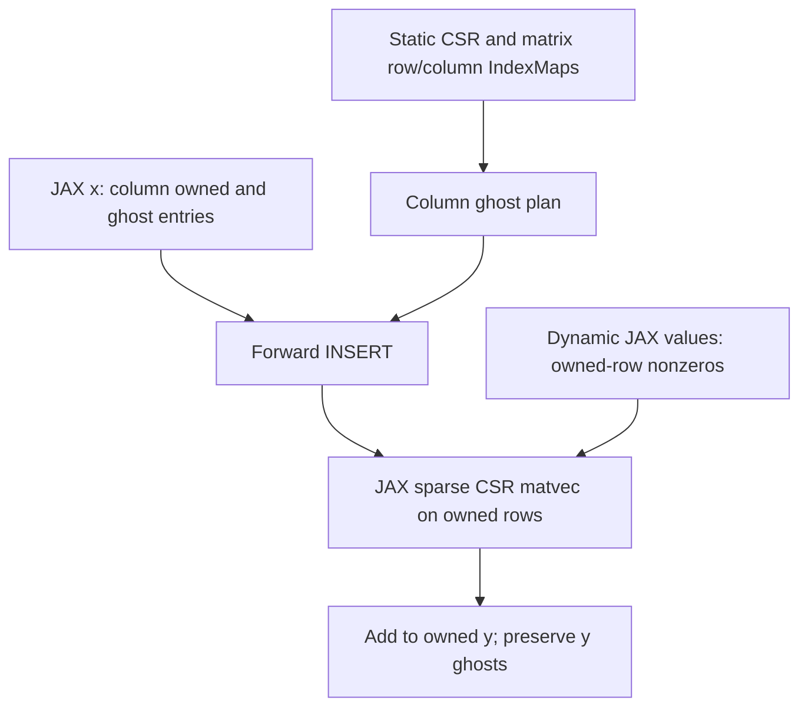

# JAX-ghost documentation

See [README.md](README.md) for a quick introduction, installation, and usage.

- [Current implementation](#first-implementation-scalar-forward-update)
- [Data flow](#how-data-moves)
- [Reverse ADD](#reverse-add-update)
- [2D example](#scalar-field-on-a-2d-square)
- [3D example](#scalar-field-on-a-3d-cube)
- [Higher-order scalar elements](#higher-order-scalar-elements)
- [Installation and testing details](#installation-and-execution)
- [Verified environment and macOS troubleshooting](#verified-environment-and-macos-setup)
- [Supported behavior and lifetime](#supported-behavior-and-lifetime)
- [Project goals](#project-goals)

## First implementation: scalar forward update

The `jaxghost` package implements explicit owner-to-ghost updates on a local
JAX array laid out as `[owned | ghosts]`. DOLFINx supplies the layout once;
JAX and mpi4jax handle numerical values during each update. Changing owned
values leaves remote ghost copies stale until all ranks call the update.

```python
import jax
import jax.numpy as jnp
from jaxghost import JAXGhost

# V is a scalar DOLFINx function space; mesh is its distributed mesh.
index_map = V.dofmap.index_map
with JAXGhost.from_index_map(
    index_map, comm=mesh.comm, block_size=V.dofmap.index_map_bs
) as ghost:
    forward = jax.jit(ghost.scatter_forward)
    x = jnp.zeros((ghost.n_owned + ghost.n_ghost,), dtype=jnp.float32)
    x = x.at[:ghost.n_owned].set(owned_values)
    x = forward(x)
    x.block_until_ready()
    jax.effects_barrier()
    # Local kernels can now read both owned values and current ghosts.
```

As with DOLFINx, the update preserves owned values and overwrites ghost values
in their original local order. JAX arrays are immutable, so assign the returned
array back to `x`. The incoming ghost values are ignored; they may be stale or
NaN. Global IDs and MPI ranks need not follow the interval's geometric order.

### How data moves



Setup runs on the host once. It groups ghost global IDs by owner, uses mpi4py
`Alltoall` for request counts and `Alltoallv` for requested IDs, then translates
incoming requests into local owned indices. Collective validation ensures that
invalid ownership requests fail on every rank. Global IDs remain host int64;
local packing indices are copied once to the JAX device as int32.

At runtime the fixed peer loop is unrolled by JIT:

1. Gather `x[send_indices]` into a packed JAX buffer.
2. Exchange each peer's slice using `mpi4jax.sendrecv`. The receive template
   supplies its shape and dtype; the returned array contains received values.
3. Concatenate received JAX buffers and set `x[receive_positions]` in one indexed
   update. A send-only rank returns its unchanged array after issuing its exchanges.

Pass a JAX array already on the local device. Direct calls reject NumPy inputs.
When wrapping the method with `jax.jit`, JAX can implicitly transfer host inputs
before entering the method; callers should still place their vectors on the
device once, outside the repeated computation. The Python peer loop and receive
list describe the static computation during tracing; vector values stay in JAX.

There is no application-level NumPy conversion, DOLFINx vector synchronization,
or global vector gather inside the forward update. CPU is treated as a JAX
device. GPU execution will require a compatible backend build; whether MPI
communicates directly from GPU memory or stages internally through host memory
depends on that deployment.

For a concrete two-rank layout:

```text
Before forward update:

Rank 0                           Rank 1
Owned global IDs: [0, 1, 2]       Owned global IDs: [3, 4, 5]
Ghost global IDs: [3]             Ghost global IDs: [2]
x = [10, 11, 12 | stale]          x = [13, 14, 15 | stale]

             Rank 0 sends [12] ───────► Rank 1
             Rank 0 receives [13] ◄─── Rank 1

After forward update:

x = [10, 11, 12 | 13]             x = [13, 14, 15 | 12]
```

Here rank 0 packs local index 2, rank 1 packs local index 0, and both unpack
into local index 3. The DOLFINx example may produce a different partition;
the implementation always derives these indices from its actual metadata.

### Reverse ADD update

`ghost.scatter_reverse(x)` adds ghost contributions into their owners and
returns the full local array `[updated owned | unchanged ghosts]`. It preserves
its input, dtype, shape, and JAX device placement. This matches DOLFINx's
`reference.x.scatter_reverse(dolfinx.la.InsertMode.add)` with JAX's functional
array semantics. ADD is the only reverse mode; no mode argument is required.

```python
reverse = jax.jit(ghost.scatter_reverse)
x = reverse(x)
# Only if ghost copies should now contain the accumulated owner values:
x = forward(x)
```

The existing plan is reused in the opposite direction, following DOLFINx's
C++ `Vector.scatter_rev_begin`/`scatter_rev_end` packing and unpacking:



Forward receive counts/offsets become reverse send counts/offsets, and vice
versa. Peers are visited in ascending rank order. Reverse uses MPI tag 1;
forward uses tag 0 on the same runtime communicator. Every rank must execute
operations in the same sequence. Send-only operations remain ordered effects,
including on ranks whose returned array needs no changes.

For an owner initially holding 10, ghost contributions of 2 and 3 produce 15.
The sending ghosts remain 2 and 3. A second reverse call produces 20; reverse
neither clears contributions nor refreshes ghosts. Assembly code must initialize
its contribution buffers before a new assembly. A forward update can distribute
accumulated values, but those refreshed copies are not new assembly contributions.

Run the single-update demonstration with:

```bash
mpirun -n 2 python examples/reverse.py
mpirun -n 4 python examples/reverse.py
```

Tests cover repeated eager/JIT accumulation, float32/float64, nonzero initial
owners, rank-dependent contributions, duplicate owner destinations, irregular
layouts, empty regions, and reverse followed by forward. P1–P3 spaces in 1D–3D
are compared against DOLFINx; synthetic cases also use an independent global-ID
oracle. Only validation gathers host data. General floating-point sums use
tolerances because accumulation order can differ between implementations.

Reverse ADD does not itself enable automatic differentiation of the scatterer.
INSERT mode, differentiation, and performance optimization
remain separate work.

### Scalar field on a 2D square

`examples/square.py` creates an 8 × 8 subdivision of the unit square with
triangular cells and a scalar continuous P1 space. Run it with:

```bash
JAX_PLATFORMS=cpu mpirun -n 2 python examples/square.py
JAX_PLATFORMS=cpu mpirun -n 4 python examples/square.py
```

Use the MPI transport settings below if needed on the development Mac.
The example uses float64 throughout and transfers owned global IDs to JAX once.
It computes `10 + global_id` on the device and performs one compiled forward
update. It checks the complete local vector
against owner values and DOLFINx's `reference.x.scatter_forward()`, then prints
owned/ghost counts, communication peers, and maximum error per rank.

Mesh dimension changes the ownership pattern, not the vector storage format:
the scalar 2D field still uses a flat `[owned | ghosts]` JAX array. As in
DOLFINx's C++ `Scatterer`, communication is derived from `IndexMap`, so the
existing `JAXGhost.scatter_forward()` needs no dimension-specific changes.
The partition and peer ranks are determined by DOLFINx, not geometric guesses.

The MPI suite includes this square mesh alongside the interval and synthetic
layouts, checking repeated eager/JIT updates, float32/float64 values, device
placement, input preservation, and agreement with DOLFINx. Contributor guidance
in [AGENTS.md](AGENTS.md) records the DOLFINx-first implementation strategy.

### Scalar field on a 3D cube

`examples/cube.py` uses DOLFINx's `create_unit_cube` with a 4 × 4 × 4
subdivision, tetrahedral cells, and a scalar continuous P1 space. Run it with:

```bash
JAX_PLATFORMS=cpu mpirun -n 4 python examples/cube.py
```

Like the square example, it uses float64, computes owned values on the JAX
device, and performs a single compiled forward update. It validates against
owner values and DOLFINx, reporting counts, peers, and maximum error per rank.
The existing IndexMap-based scatterer needs no changes for 3D: storage remains
`[owned | ghosts]`. The MPI suite also checks the cube with repeated eager/JIT
updates and both float32 and float64 values.

### Higher-order scalar elements

All three examples support continuous scalar Lagrange P1, P2, and P3 spaces:

```bash
mpirun -n 2 python examples/interval.py --degree 2
mpirun -n 4 python examples/square.py --degree 3
mpirun -n 4 python examples/cube.py --degree 3
```

The default degree remains 1, and each example performs one forward update.
DOLFINx's `fem.functionspace(domain, ("Lagrange", degree))` constructs the
appropriate element and DoF map. Its IndexMap includes all owned and ghost
DoFs, not only vertex DoFs. JAXGhost uses that complete layout without adding
special cases for edges, faces, or cell interiors.

Polynomial degree is not block size: these scalar spaces still have
`index_map_bs == 1`. Build a new plan when constructing a different space;
a P1 plan must not be reused for a P2 or P3 layout. This extension concerns
coefficient synchronization only, not element evaluation or assembly.

The pytest suite parametrizes all three mesh cases over degrees 1–3. For each,
it compares every local coefficient with its owner and DOLFINx in eager and
compiled execution, using float32/float64 and repeated updates. It also checks
that P2/P3 spaces contain more global DoFs than mesh vertices.

### Installation and execution

Use an environment containing DOLFINx, JAX, mpi4py, and the pinned
`mpi4jax==0.9.1.post1`. MPI, mpi4py, mpi4jax, and DOLFINx must use compatible
MPI libraries. Install this package without replacing that scientific stack:

```bash
cd /path/to/JAX-ghost
python -m pip install --no-deps --no-build-isolation -e .
export JAX_PLATFORMS=cpu
export JAX_NUM_CPU_DEVICES=1
export OMP_NUM_THREADS=1
mpirun -n 2 python examples/interval.py
python scripts/run_mpi_tests.py
```

Install pytest if needed with `python -m pip install pytest`. To run the
correctness tests directly on four ranks:

```bash
mpirun -n 4 python -m pytest tests/test_mpi.py -v
```

Use `scripts/run_mpi_tests.py` for timeout protection. Do not distribute these collective
tests with pytest-xdist: every MPI rank must execute the same tests in the same
order.

The test runner uses the current Python interpreter, first executes an
independent two-rank compiled mpi4jax smoke test, then runs pytest cases with
1, 2, 3, and 4 ranks. Each MPI job has a 120-second timeout and timed-out process
groups are terminated. Options include `--mpirun /path/to/mpirun`,
`--timeout 300`, and `--ranks 1 2 3`. Pytest is required for the test suite. The
DOLFINx tests are explicitly skipped if DOLFINx is absent; all examples require it.

One local JAX device per rank is enforced during construction. CPU device count
does not itself bind a process to one CPU core; use your MPI launcher's binding
options or scheduler configuration if physical core placement is required.
No `jax.distributed.initialize`, `pmap`, or global JAX sharding is needed.

### Verified environment and macOS setup

Verified on macOS ARM64 on 2026-09-07:

| Dependency | Tested version |
| --- | --- |
| Python | 3.11.15 |
| JAX / jaxlib | 0.10.2 / 0.10.2 |
| mpi4jax | 0.9.1.post1, built natively for ARM64 |
| mpi4py | 4.1.2 |
| MPI | MPICH 5.0.1, ch4:ofi, TCP provider |
| NumPy | 2.4.6 |
| DOLFINx | 0.11.0 |

The compiled two-rank smoke test and the correctness suite passed with 1, 2, 3,
and 4 ranks, including the DOLFINx reference, float32/float64, and repeated eager
and compiled updates. The single-rank run skips the test requiring an invalid
remote request; all multi-rank cases run. GPU execution has not been tested.

The existing `fenicsx-0.11.0` conda environment on the development machine had
an x86_64 mpi4jax extension despite an ARM64 Python. Validation used an isolated
virtual environment inheriting that conda environment, with mpi4jax rebuilt
for ARM64. The original conda environment was not modified. To reproduce this
repair locally from the repository root:

```bash
conda activate fenicsx-0.11.0
python -m venv --system-site-packages .venv
source .venv/bin/activate
python -m pip install nanobind wheel
MPI4JAX_BUILD_MPICC="$CONDA_PREFIX/bin/mpicc" python -m pip install \
  --no-deps --no-build-isolation --no-binary=mpi4jax --ignore-installed \
  mpi4jax==0.9.1.post1
python -m pip install --no-deps --no-build-isolation -e .
```

The default libfabric sockets provider also hung in `MPI_Finalize`, including
for a minimal mpi4py-only program. The complete test runs exited normally with:

```bash
export FI_PROVIDER=tcp
export FI_TCP_IFACE=en0
python scripts/run_mpi_tests.py
```

These are development-machine transport settings, not library defaults. Select
the appropriate interface for your machine; do not apply `en0` to a cluster
without checking its network setup. Related macOS sockets-provider behavior is
documented in [MPICH issue 6856](https://github.com/pmodels/mpich/issues/6856).

### Supported behavior and lifetime

| Operation | Inside `jax.jit`? | Data |
| --- | --- | --- |
| `JAXGhost.from_index_map(...)` | No | Host ownership metadata and initial device indices |
| `ghost.scatter_forward(x)` | Yes | JAX float32 or float64 arrays |
| `ghost.scatter_reverse(x)` | Yes | JAX float32 or float64 arrays; ADD into owners |
| Local numerical kernels | Yes | JAX arrays |
| `ghost.close()` | No | Wait for effects and release the MPI communicator |

- Use a positive integer `block_size` (default `1`), identical on all ranks,
  and shape `(n_owned + n_ghost,)`; these counts include all scalar components.
  Enable `jax_enable_x64` before creating arrays to use float64.
- All participating ranks must call setup and updates in the same sequence,
  with matching numerical dtypes. Shapes and dtypes are checked locally;
  inconsistent runtime calls across ranks are a caller error and may hang MPI.
- Irregular ghost order, multiple neighbors, unequal message lengths, and
  zero-ghost ranks that still send are supported. No communication occurs for
  a rank with neither sending nor receiving peers.
- Peers are visited in ascending rank order, using empty buffers for an absent
  direction. This common ordering avoids cyclic waits in the blocking peer
  exchanges; it prioritizes simplicity over communication overlap.
- mpi4jax 0.9.1.post1 uses ordered effects internally and returns an array,
  rather than the `(array, token)` interface found in older examples. These
  effects also retain send-only calls whose receive arrays are empty.
- Each plan owns a duplicated runtime communicator. Setup uses the caller's
  communicator; numerical runtime communication uses only the duplicate.
  Complete work with `jax.effects_barrier()` before teardown. The context
  manager does this automatically. Discard compiled functions when closing
  their plan; never call a cached compiled function after `close()`.
- Treat the plan as immutable. Rebuild it if the partition or ghost layout
  changes. Concurrent updates from multiple Python threads are unsupported.

Reverse INSERT, differentiation through communication, GPU
validation, and communication/computation overlap are future work. The forward
operation alone does not establish correct distributed automatic differentiation.

The design follows DOLFINx's
[packing and explicit scatter semantics](https://github.com/FEniCS/dolfinx/blob/main/cpp/dolfinx/common/Scatterer.h).
DOLFINx normally uses neighborhood collectives; this first backend uses
[mpi4jax sendrecv](https://mpi4jax.readthedocs.io/en/stable/api.html#mpi4jax.sendrecv).
See also mpi4jax's
[communicator guidance](https://mpi4jax.readthedocs.io/en/latest/sharp-bits.html)
and [installation guidance](https://mpi4jax.readthedocs.io/en/stable/installation.html).

## Project goals

The following sections describe the broader project goals and target interfaces.
Forward INSERT, reverse ADD and scalar distributed CSR matvec are implemented.
Automatic differentiation remains future work; the interfaces below are schematic.

Implement a reusable JAX-compatible abstraction for synchronizing **owned and ghost entries** of vectors distributed across multiple MPI processes and JAX devices.

DOLFINx supplies the distributed mesh, degree-of-freedom map, and ownership metadata. JAX owns the numerical arrays used during execution.

Each process stores

\[
x_p = [x_p^{\mathrm{owned}} \mid x_p^{\mathrm{ghost}}].
\]

Every global entry has one owner, while other processes may hold ghost copies required for local computation.

## Core operations

### Forward scatter

```python
x_local = scatter_forward(x_owned, layout)
```

Copy current owner values into the corresponding ghost entries:

\[
x_{p,i}^{\mathrm{ghost}} = x_{\operatorname{owner}(i),i}^{\mathrm{owned}}.
\]

### Reverse scatter

```python
x_owned = scatter_reverse(x_local, layout, op="sum")
```

Accumulate ghost contributions back into their owners:

\[
x_i^{\mathrm{owned}} \mathrel{+}= \sum_{p:\,i\in G_p} x_{p,i}^{\mathrm{ghost}}.
\]

## DOLFINx and JAX responsibilities

DOLFINx provides:

- distributed mesh and function space;
- cell-to-DoF map;
- `IndexMap` ownership and ghost metadata;
- local sparse matrix structure for the demonstration.

JAX provides:

- persistent device arrays for vector and matrix data;
- packing and unpacking kernels;
- local sparse matrix-vector multiplication;
- JIT compilation and automatic differentiation.

Initial copies of static metadata and matrix data to JAX devices are acceptable. Repeated DOLFINx/PETSc-to-JAX synchronization and shared-memory interoperability are outside the hackathon scope.

## Minimum implementation

Build a static communication layout from a DOLFINx `IndexMap`, containing:

- number of locally owned entries;
- global indices and owners of ghost entries;
- source and destination ranks;
- local send and receive indices;
- packed message sizes and offsets.

Use `mpi4jax`, native JAX communication, or another suitable backend. Packing, communication, unpacking, and local numerical operations should work with `jax.jit` wherever possible.

A target interface is:

```python
scatterer = JAXScatterer.from_index_map(V.dofmap.index_map)
x_local = scatterer.forward(x_owned)
x_owned = scatterer.reverse_add(x_local)
y_owned = distributed_spmv(A_local, x_owned, scatterer)
```


## Block-valued fields

Pass `block_size=V.dofmap.index_map_bs` for a blocked DOLFINx space, for example
`fem.functionspace(domain, ("Lagrange", 2, (2,)))`. Both forward INSERT and reverse
ADD operate component by component. The input stays flat in DOLFINx order:
`[owned0_c0, owned0_c1, owned1_c0, owned1_c1, ... | ghost0_c0, ghost0_c1, ...]`.
`ghost.block_size` records the block size; `ghost.n_owned` and `ghost.n_ghost`
count scalar entries, so the input length is
`block_size * (index_map.size_local + index_map.num_ghosts)`.

Following DOLFINx's C++ Scatterer, setup exchanges block global IDs and expands
packing indices as `block_size * index + component`. Counts and offsets are
scaled by block size before creating the runtime plan. This preserves component
and ghost ordering without introducing runtime reshaping or host transfers.
The communication algorithm and indexed forward SET / reverse ADD are unchanged.
This supports uniform fixed-size blocks, not arbitrary mixed-space layouts.

MPI tests cover representative scalar, vector and tensor layouts, component-dependent values,
eager/JIT execution, float32/float64, repeated reverse accumulation and forward
refresh against DOLFINx. Synthetic cases include unsorted ghosts, asymmetric
messages, multiple contributors, empty owned regions and no communication.


Full tensor fields through order four are checked against DOLFINx using actual
tensor-valued spaces: `(2, 2)`, `(2, 2, 2)` and `(3, 3, 3, 3)` (block sizes
4, 8 and 81). Tensor order is independent of mesh dimension and polynomial
degree. Symmetry-reduced tensor storage is not covered.

The essential suite selects eight regular-mesh layouts: scalar interval P1,
square P2 and cube P3; two vector layouts; and one layout per tensor order.
It also checks four synthetic communication patterns, one irregular P2 vector
layout, and input/lifetime validation. Every numerical case retains eager/JIT,
float32/float64, repeated updates, input preservation, and reverse-then-forward
checks. This is representative coverage, not every combination of features.


## Irregular 2D geometry and uneven partitions

`mpirun -n 4 python examples/irregular.py --degree 2` constructs a connected
L-shaped domain with a clipped exterior corner and 53 triangular cells.
DOLFINx partitions the mesh and supplies the resulting DoF IndexMap. Since 53
is not divisible by 2, 3 or 4, the owned cell counts must differ for these rank
counts; the example and tests explicitly verify this. This is a modest uneven
partition, not a deliberately severe load imbalance: unusual geometry alone
does not defeat DOLFINx's graph partitioner's balancing objective.

The example reports owned cells, owned/ghost DoFs, peers and forward error per
rank. Tests additionally check reverse ADD and forward refresh for a P2 vector
field, eager/JIT and float32/float64, using the
same DOLFINx and global-ID comparisons as the regular-mesh tests. Cell imbalance
does not imply a particular DoF imbalance or geometric ordering of ranks.


## Scalar distributed CSR matvec

`JAXMatrixCSR.from_dolfinx(A, comm)` reads static CSR structure and both
IndexMaps. DOLFINx creates MatrixCSR from finalized sparsity; numerical assembly
must also be completed (`A.scatter_reverse()`) before coefficients are copied.
There is no exposed numerical-finalization flag to check. The operator never
reads `A.data` itself and does not retain A. Only owned-row CSR entries are kept.
`nnz_owned`, `n_owned_rows`, `n_ghost_rows`, `n_owned_cols` and `n_ghost_cols`
describe the operand lengths. Scalar matrix block sizes `[1, 1]` are required.



`mult(values, x, y)` is JIT compatible. All three arrays must be flat device
arrays of matching float32/float64 dtype, with lengths `nnz_owned`,
`n_owned_cols + n_ghost_cols`, and `n_owned_rows + n_ghost_rows` respectively.
Change coefficients by passing new values with the same sparsity and ordering.
The column IndexMap can differ from the function-space map after sparsity
finalization. No reverse scatter or output ghost refresh is required for this
owned-row product. All input arrays, including stale input ghosts, are preserved.

DOLFINx's C++ `MatrixCSR::mult` starts forward communication, computes the
owned-column contribution, completes communication, and adds remote-column
contributions. This baseline uses the existing complete forward scatter then
JAX's experimental sparse CSR matvec; it does not expose communication overlap.
It returns a new full local y rather than mutating x or y. Zero-nonzero ranks
still execute any required input sends. Context teardown waits for MPI effects;
discard compiled functions before using a closed operator. Calls must follow
the same rank sequence and dtype; runtime validation is local, so inconsistent
calls across ranks can hang. No GPU performance or derivative support is claimed.

The example uses a P1 square mass-plus-diffusion matrix and one compiled update.
Three essential tests cover a DOLFINx reference, rectangular/asymmetric synthetic
layout with an empty row, and validation/lifetime checks. Numerical checks include
eager/JIT, both precisions, changed values, nonzero initial y, stale ghosts,
input preservation and device placement. Benchmarks and extensions are in TODO.md.


## Sharded forward backend

`ShardedJAXGhost` implements forward INSERT with `jax.shard_map` and native
`jax.lax.all_to_all`. It shares the one-time host IndexMap request builder with
JAXGhost, preserving DOLFINx ghost ordering and block-component expansion.
mpi4py communicates metadata only. The sharded numerical path does not call
mpi4jax or duplicate an MPI communicator, although mpi4jax remains an installed
package dependency for the existing backend. No `close()` is needed on a sharded
plan; the application owns JAX distributed initialization and shutdown.

The global numerical array has shape `(nranks, padded_length)` and
`NamedSharding(mesh, PartitionSpec("rank", None))`. Each device stores one row:
`[owned | ghosts | padding]`, where `padded_length` is at least one and otherwise
the maximum local scalar length. This is a padded collection of local buffers,
not a global owned-only vector: reductions must exclude ghosts and padding.
`n_owned` and `n_ghost` report this process's unpadded scalar counts.
`to_sharded(local)` pads a JAX device array and constructs its global descriptor
without gathering its numerical data. `local_array(global_array)` returns the
unpadded addressable JAX shard. Both helpers run outside JIT.

The plan is an immutable pytree. Its index tables and masks are sharded dynamic
leaves; static mesh, block size, global counts and padded dimensions are the same
on every process. Compile with
`jax.jit(ShardedJAXGhost.scatter_forward)(ghost, x)` so those leaves are operands,
not different constants embedded in each process's program. Each device runs
the same gather/all-to-all/indexed-SET program, using only its own index-table
shards. Invalid sends are zero; invalid receive positions use an out-of-bounds
drop sentinel. Forward preserves inputs, owned entries, and padding. Arrays
must use matching float32/float64 dtypes across ranks. Runtime shape/dtype checks
are local; the caller must execute matching operations on every process.

Each local communication buffer has shape `(nranks, max_message_length)`, with
message length at least one. This deliberately simple baseline pads missing
peers and unequal messages. It does not claim lower communication cost than the
existing peer-based backend. Reverse scatter, AD, GPU validation and
neighbor-permutation schedules are deferred. Scalar CSR integration is described below.

### Launch and test

Initialize distributed JAX before any device query and construct a 1D mesh named
`rank`. Require one local device per process, all participating JAX devices in
MPI rank order, and a communicator spanning all JAX processes (no subcommunicators).
All metadata construction is collective. Supported setup is tested with JAX and
jaxlib 0.10.2; the rest of the environment matches the versions listed above.

```bash
JAX_PLATFORMS=cpu JAX_NUM_CPU_DEVICES=1 mpirun -n 2 python examples/sharded.py
python scripts/run_sharding_tests.py
python scripts/run_sharding_tests.py --example --ranks 2 4
```

The separate runner initializes JAX before importing tests. Its seven focused
cases cover native all-to-all, unsorted/multiple-neighbor layouts, asymmetric
zero-ghost senders, empty owned and fully empty layouts, an irregular DOLFINx P2
vector field, and validation. They exercise eager/JIT, float32/float64, changed
owned values, input and padding preservation. The file is deliberately named
`sharding_checks.py` so ordinary pytest discovery does not initialize distributed
JAX inside the existing mpi4jax test process. The runner defaults to CPU, 1–4
ranks and a 120-second timeout per job, killing the job's process group on timeout.

### macOS single-host workaround

On this machine, default coordinator discovery timed out; using a loopback
coordinator revealed a second issue: Gloo could not resolve the local hostname.
The optional `--local-cpu` launcher mode explicitly binds both services to
127.0.0.1, and removes proxy settings only from launched child environments.
It changes no system network configuration. It uses private JAX CPU-client
hooks verified on 0.10.2 and may need adjustment after a JAX upgrade. This mode
is for single-host CPU tests only; never use loopback for a multi-host job.
The normal library and launch path do not use these hooks.

```bash
FI_PROVIDER=tcp FI_TCP_IFACE=en0 python scripts/run_sharding_tests.py --local-cpu
FI_PROVIDER=tcp FI_TCP_IFACE=en0 python scripts/run_sharding_tests.py --local-cpu --example --ranks 2 4
```

FI_PROVIDER/FI_TCP_IFACE configure mpi4py's MPICH setup transport, not JAX's
native all-to-all. Distributed tests must pass before claiming support on a new
machine; single-process multiple-device tests are not equivalent evidence.


## Sharded scalar CSR matvec

`ShardedJAXMatrixCSR` follows `MatrixCSR::mult` in DOLFINx C++: use the matrix
column IndexMap to refresh input ghosts, then accumulate into owned output rows.
This version completes the native JAX exchange before CSR computation; DOLFINx
instead overlaps that exchange with its owned-column contribution.

The data flow is local JAX coefficients/x/y → on-device padding and global sharded
array construction → column ghost forward update → local sparse CSR matvec →
add to owned y → unpadded local JAX output view. Host transfers in the example
are explicit initialization and validation only. Input x, coefficients, y,
output ghosts and output padding are preserved.

Global buffers have shape `(nranks, width)`, sharded along `rank`. Values are
padded to the maximum owned-row nonzero count; x and y use separate column and
row layout widths. CSR row pointers are padded with the last pointer, making
extra rows empty. All ranks execute a uniform kernel, including ranks with no
owned rows or nonzeros. A dynamic mask preserves non-owned output slots.
Rank-specific CSR indices, pointers and masks are sharded pytree leaves; pass
the operator explicitly to JIT. Coefficients can change without rebuilding the
plan, provided sparsity and dtype remain compatible. `sparse.CSR` describes the
local padded operands during tracing; no DOLFINx matrix is reconstructed during
execution. Padding increases storage; no performance improvement is claimed.

Only scalar float32/float64 matrices are supported. Assembly must be finalized
before transferring coefficients. There is no MPI runtime communicator or close
operation; distributed JAX initialization/shutdown remains caller-owned. Reverse,
transpose, differentiation, blocked CSR and GPU validation remain separate work.

The isolated sharding suite includes DOLFINx mass-plus-diffusion comparisons in
eager/JIT execution at both precisions, changed coefficients, stale input ghosts,
nonzero output, input/ghost/padding preservation, and a synthetic rectangular
case with asymmetric exchange, empty rows and empty ranks, plus all-empty layouts.
Use `python scripts/run_sharding_tests.py --local-cpu` on the tested macOS setup.
The standalone example is `python scripts/run_sharding_tests.py --local-cpu
--matvec-example --ranks 2 4` (one shell line).

Validated on CPU with JAX/jaxlib 0.10.2 and DOLFINx 0.11.0: all 10 sharding
checks passed on 1–4 MPI ranks, and the example passed on 2 and 4 ranks with
maximum absolute error below 1.8e-14 against DOLFINx. The opt-in loopback/Gloo
launcher was used; this does not establish GPU compatibility or performance.
