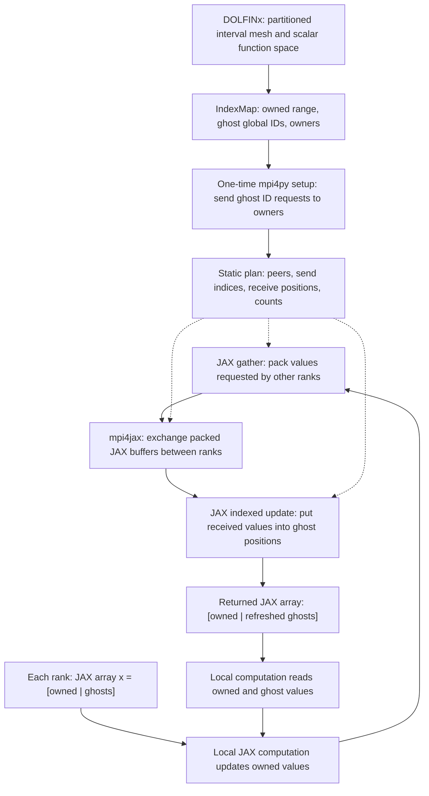

# JAX-ghost

Distributed Ghost Updates for JAX used within MPI-parallelized FEM code

## First implementation: scalar forward update

The `jaxghost` package implements explicit owner-to-ghost updates on a local
JAX array laid out as `[owned | ghosts]`. DOLFINx supplies the layout once;
JAX and mpi4jax handle numerical values during each update. Changing owned
values leaves remote ghost copies stale until all ranks call the update.

```python
import jax
import jax.numpy as jnp
from jaxghost import JAXGhost

# V is a scalar DOLFINx function space; mesh is its distributed mesh.
index_map = V.dofmap.index_map
with JAXGhost.from_index_map(
    index_map, comm=mesh.comm, block_size=V.dofmap.index_map_bs
) as ghost:
    forward = jax.jit(ghost.scatter_forward)
    x = jnp.zeros((ghost.n_owned + ghost.n_ghost,), dtype=jnp.float32)
    x = x.at[:ghost.n_owned].set(owned_values)
    x = forward(x)
    x.block_until_ready()
    jax.effects_barrier()
    # Local kernels can now read both owned values and current ghosts.
```

As with DOLFINx, the update preserves owned values and overwrites ghost values
in their original local order. JAX arrays are immutable, so assign the returned
array back to `x`. The incoming ghost values are ignored; they may be stale or
NaN. Global IDs and MPI ranks need not follow the interval's geometric order.

### How data moves



Setup runs on the host once. It groups ghost global IDs by owner, uses mpi4py
`Alltoall` for request counts and `Alltoallv` for requested IDs, then translates
incoming requests into local owned indices. Collective validation ensures that
invalid ownership requests fail on every rank. Global IDs remain host int64;
local packing indices are copied once to the JAX device as int32.

At runtime the fixed peer loop is unrolled by JIT:

1. Gather `x[send_indices]` into a packed JAX buffer.
2. Exchange each peer's slice using `mpi4jax.sendrecv`. The receive template
   supplies its shape and dtype; the returned array contains received values.
3. Concatenate received JAX buffers and set `x[receive_positions]` in one indexed
   update. A send-only rank returns its unchanged array after issuing its exchanges.

Pass a JAX array already on the local device. Direct calls reject NumPy inputs.
When wrapping the method with `jax.jit`, JAX can implicitly transfer host inputs
before entering the method; callers should still place their vectors on the
device once, outside the repeated computation. The Python peer loop and receive
list describe the static computation during tracing; vector values stay in JAX.

There is no application-level NumPy conversion, DOLFINx vector synchronization,
or global vector gather inside the forward update. CPU is treated as a JAX
device. GPU execution will require a compatible backend build; whether MPI
communicates directly from GPU memory or stages internally through host memory
depends on that deployment.

For a concrete two-rank layout:

```text
Before forward update:

Rank 0                           Rank 1
Owned global IDs: [0, 1, 2]       Owned global IDs: [3, 4, 5]
Ghost global IDs: [3]             Ghost global IDs: [2]
x = [10, 11, 12 | stale]          x = [13, 14, 15 | stale]

             Rank 0 sends [12] ───────► Rank 1
             Rank 0 receives [13] ◄─── Rank 1

After forward update:

x = [10, 11, 12 | 13]             x = [13, 14, 15 | 12]
```

Here rank 0 packs local index 2, rank 1 packs local index 0, and both unpack
into local index 3. The DOLFINx example may produce a different partition;
the implementation always derives these indices from its actual metadata.

### Scalar field on a 2D square

`examples/square.py` creates an 8 × 8 subdivision of the unit square with
triangular cells and a scalar continuous P1 space. Run it with:

```bash
JAX_PLATFORMS=cpu mpirun -n 2 python examples/square.py
JAX_PLATFORMS=cpu mpirun -n 4 python examples/square.py
```

Use the MPI transport settings below if needed on the development Mac.
The example uses float64 throughout and transfers owned global IDs to JAX once.
It computes `10 + global_id` on the device and performs one compiled forward
update. It checks the complete local vector
against owner values and DOLFINx's `reference.x.scatter_forward()`, then prints
owned/ghost counts, communication peers, and maximum error per rank.

Mesh dimension changes the ownership pattern, not the vector storage format:
the scalar 2D field still uses a flat `[owned | ghosts]` JAX array. As in
DOLFINx's C++ `Scatterer`, communication is derived from `IndexMap`, so the
existing `JAXGhost.scatter_forward()` needs no dimension-specific changes.
The partition and peer ranks are determined by DOLFINx, not geometric guesses.

The MPI suite includes this square mesh alongside the interval and synthetic
layouts, checking repeated eager/JIT updates, float32/float64 values, device
placement, input preservation, and agreement with DOLFINx. Contributor guidance
in [AGENTS.md](AGENTS.md) records the DOLFINx-first implementation strategy.

### Installation and execution

Use an environment containing DOLFINx, JAX, mpi4py, and the pinned
`mpi4jax==0.9.1.post1`. MPI, mpi4py, mpi4jax, and DOLFINx must use compatible
MPI libraries. Install this package without replacing that scientific stack:

```bash
cd /path/to/JAX-ghost
python -m pip install --no-deps --no-build-isolation -e .
export JAX_PLATFORMS=cpu
export JAX_NUM_CPU_DEVICES=1
export OMP_NUM_THREADS=1
mpirun -n 2 python examples/interval.py
python scripts/run_mpi_tests.py
```

Install pytest if needed with `python -m pip install pytest`. To run the
correctness tests directly on four ranks:

```bash
mpirun -n 4 python -m pytest tests/test_mpi.py -v
```

Use `scripts/run_mpi_tests.py` for timeout protection. Do not distribute these collective
tests with pytest-xdist: every MPI rank must execute the same tests in the same
order.

The test runner uses the current Python interpreter, first executes an
independent two-rank compiled mpi4jax smoke test, then runs pytest cases with
1, 2, 3, and 4 ranks. Each MPI job has a 120-second timeout and timed-out process
groups are terminated. Options include `--mpirun /path/to/mpirun`,
`--timeout 180`, and `--ranks 1 2 3`. Pytest is required for the test suite. The
DOLFINx tests are explicitly skipped if DOLFINx is absent; both examples require it.

One local JAX device per rank is enforced during construction. CPU device count
does not itself bind a process to one CPU core; use your MPI launcher's binding
options or scheduler configuration if physical core placement is required.
No `jax.distributed.initialize`, `pmap`, or global JAX sharding is needed.

### Verified environment and macOS setup

Verified on macOS ARM64 on 2026-09-07:

| Dependency | Tested version |
| --- | --- |
| Python | 3.11.15 |
| JAX / jaxlib | 0.10.2 / 0.10.2 |
| mpi4jax | 0.9.1.post1, built natively for ARM64 |
| mpi4py | 4.1.2 |
| MPI | MPICH 5.0.1, ch4:ofi, TCP provider |
| NumPy | 2.4.6 |
| DOLFINx | 0.11.0 |

The compiled two-rank smoke test and the correctness suite passed with 1, 2, 3,
and 4 ranks, including the DOLFINx reference, float32/float64, and repeated eager
and compiled updates. The single-rank run skips the test requiring an invalid
remote request; all multi-rank cases run. GPU execution has not been tested.

The existing `fenicsx-0.11.0` conda environment on the development machine had
an x86_64 mpi4jax extension despite an ARM64 Python. Validation used an isolated
virtual environment inheriting that conda environment, with mpi4jax rebuilt
for ARM64. The original conda environment was not modified. To reproduce this
repair locally from the repository root:

```bash
conda activate fenicsx-0.11.0
python -m venv --system-site-packages .venv
source .venv/bin/activate
python -m pip install nanobind wheel
MPI4JAX_BUILD_MPICC="$CONDA_PREFIX/bin/mpicc" python -m pip install \
  --no-deps --no-build-isolation --no-binary=mpi4jax --ignore-installed \
  mpi4jax==0.9.1.post1
python -m pip install --no-deps --no-build-isolation -e .
```

The default libfabric sockets provider also hung in `MPI_Finalize`, including
for a minimal mpi4py-only program. The complete test runs exited normally with:

```bash
export FI_PROVIDER=tcp
export FI_TCP_IFACE=en0
python scripts/run_mpi_tests.py
```

These are development-machine transport settings, not library defaults. Select
the appropriate interface for your machine; do not apply `en0` to a cluster
without checking its network setup. Related macOS sockets-provider behavior is
documented in [MPICH issue 6856](https://github.com/pmodels/mpich/issues/6856).

### Supported behavior and lifetime

| Operation | Inside `jax.jit`? | Data |
| --- | --- | --- |
| `JAXGhost.from_index_map(...)` | No | Host ownership metadata and initial device indices |
| `ghost.scatter_forward(x)` | Yes | JAX float32 or float64 arrays |
| Local numerical kernels | Yes | JAX arrays |
| `ghost.close()` | No | Wait for effects and release the MPI communicator |

- Use scalar entries (`block_size=1`) and shape `(n_owned + n_ghost,)`.
  Enable `jax_enable_x64` before creating arrays to use float64.
- All participating ranks must call setup and updates in the same sequence,
  with matching numerical dtypes. Shapes and dtypes are checked locally;
  inconsistent runtime calls across ranks are a caller error and may hang MPI.
- Irregular ghost order, multiple neighbors, unequal message lengths, and
  zero-ghost ranks that still send are supported. No communication occurs for
  a rank with neither sending nor receiving peers.
- Peers are visited in ascending rank order, using empty buffers for an absent
  direction. This common ordering avoids cyclic waits in the blocking peer
  exchanges; it prioritizes simplicity over communication overlap.
- mpi4jax 0.9.1.post1 uses ordered effects internally and returns an array,
  rather than the `(array, token)` interface found in older examples. These
  effects also retain send-only calls whose receive arrays are empty.
- Each plan owns a duplicated runtime communicator. Setup uses the caller's
  communicator; numerical runtime communication uses only the duplicate.
  Complete work with `jax.effects_barrier()` before teardown. The context
  manager does this automatically. Discard compiled functions when closing
  their plan; never call a cached compiled function after `close()`.
- Treat the plan as immutable. Rebuild it if the partition or ghost layout
  changes. Concurrent updates from multiple Python threads are unsupported.

Reverse scatter, differentiation through communication, sparse matvec, GPU
validation, and communication/computation overlap are future work. The forward
operation alone does not establish correct distributed automatic differentiation.

The design follows DOLFINx's
[packing and explicit scatter semantics](https://github.com/FEniCS/dolfinx/blob/main/cpp/dolfinx/common/Scatterer.h).
DOLFINx normally uses neighborhood collectives; this first backend uses
[mpi4jax sendrecv](https://mpi4jax.readthedocs.io/en/stable/api.html#mpi4jax.sendrecv).
See also mpi4jax's
[communicator guidance](https://mpi4jax.readthedocs.io/en/latest/sharp-bits.html)
and [installation guidance](https://mpi4jax.readthedocs.io/en/stable/installation.html).

## Challenge

Implement a reusable JAX-compatible abstraction for synchronizing **owned and ghost entries** of vectors distributed across multiple MPI processes and JAX devices.

DOLFINx supplies the distributed mesh, degree-of-freedom map, and ownership metadata. JAX owns the numerical arrays used during execution.

Each process stores

\[
x_p = [x_p^{\mathrm{owned}} \mid x_p^{\mathrm{ghost}}].
\]

Every global entry has one owner, while other processes may hold ghost copies required for local computation.

## Core operations

### Forward scatter

```python
x_local = scatter_forward(x_owned, layout)
```

Copy current owner values into the corresponding ghost entries:

\[
x_{p,i}^{\mathrm{ghost}} = x_{\operatorname{owner}(i),i}^{\mathrm{owned}}.
\]

### Reverse scatter

```python
x_owned = scatter_reverse(x_local, layout, op="sum")
```

Accumulate ghost contributions back into their owners:

\[
x_i^{\mathrm{owned}} \mathrel{+}= \sum_{p:\,i\in G_p} x_{p,i}^{\mathrm{ghost}}.
\]

## DOLFINx and JAX responsibilities

DOLFINx provides:

- distributed mesh and function space;
- cell-to-DoF map;
- `IndexMap` ownership and ghost metadata;
- local sparse matrix structure for the demonstration.

JAX provides:

- persistent device arrays for vector and matrix data;
- packing and unpacking kernels;
- local sparse matrix-vector multiplication;
- JIT compilation and automatic differentiation.

Initial copies of static metadata and matrix data to JAX devices are acceptable. Repeated DOLFINx/PETSc-to-JAX synchronization and shared-memory interoperability are outside the hackathon scope.

## Minimum implementation

Build a static communication layout from a DOLFINx `IndexMap`, containing:

- number of locally owned entries;
- global indices and owners of ghost entries;
- source and destination ranks;
- local send and receive indices;
- packed message sizes and offsets.

Use `mpi4jax`, native JAX communication, or another suitable backend. Packing, communication, unpacking, and local numerical operations should work with `jax.jit` wherever possible.

A target interface is:

```python
scatterer = JAXScatterer.from_index_map(V.dofmap.index_map)
x_local = scatterer.forward(x_owned)
x_owned = scatterer.reverse_add(x_local)
y_owned = distributed_spmv(A_local, x_owned, scatterer)
```
