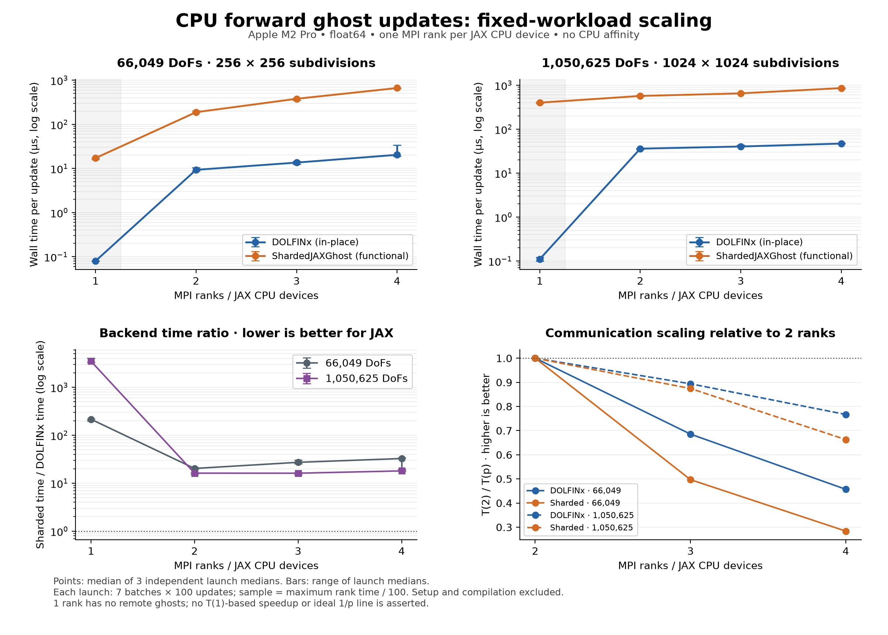
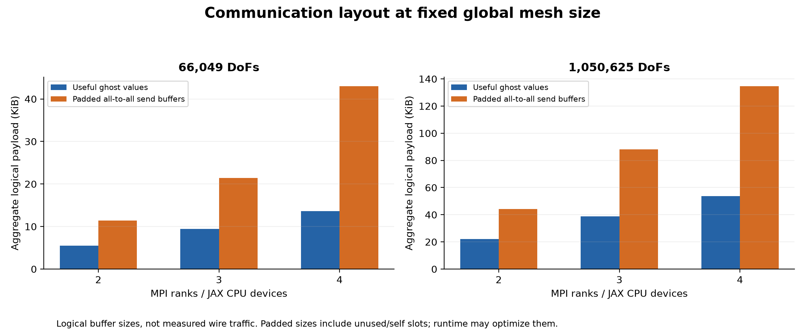

# CPU sharded forward-update scaling

## Measured results

On 2–4 devices, the sharded backend took 16.1–32.6× the DOLFINx update time. Both backends' median latency increased from 2 to 4 devices for each mesh. This implementation shows no latency benefit from adding CPU devices in these measurements; the timings alone do not isolate the cause.

| Global DoFs | Ranks/devices | DOLFINx µs | Sharded µs | Sharded / DOLFINx |
| ---: | ---: | ---: | ---: | ---: |
| 66,049 | 1 | 0.08 | 17.20 | 215.00× |
| 66,049 | 2 | 9.30 | 188.33 | 20.25× |
| 66,049 | 3 | 13.57 | 379.09 | 27.20× |
| 66,049 | 4 | 20.36 | 663.77 | 32.63× |
| 1,050,625 | 1 | 0.11 | 398.52 | 3488.18× |
| 1,050,625 | 2 | 35.86 | 566.91 | 16.17× |
| 1,050,625 | 3 | 40.12 | 648.50 | 16.12× |
| 1,050,625 | 4 | 46.77 | 855.43 | 18.02× |

All changed-value checks and per-batch checks matched DOLFINx and the independent
global-ID oracle exactly (maximum absolute error 0). The sharded input-preservation
check also passed. Each point uses the same fixed global mesh for every rank count.

## Method

- Two triangular unit-square meshes: 256² and 1024² subdivisions; scalar continuous P1, float64.
- Ranks/devices: 1, 2, 3, 4; three independent MPI launches per point.
- Ten warmup updates; seven timed batches of 100 Python-driven calls per backend.
- MPI barrier before each batch, outside timing. MPI.Wtime measures each rank.
  The sharded output is blocked before stopping the timer; no per-call barrier.
- Each batch sample is the maximum rank elapsed time divided by 100.
  Plots report the median of the three launch medians, with their min/max range.
  Ratios are computed within launches, then their median/range is plotted.
- Alternate backend order between batches and reverse rank/mesh order on alternate
  trials. Launches run sequentially, not concurrently.
- Mesh/space setup, metadata preparation, transfers, compilation, first execution,
  correctness checks and result I/O are excluded from steady-state timing.
- Numerical inputs stay fixed during a timed batch. Each Python call still applies
  the forward update; repeated calls are not fused into an outer compiled loop.
- Raw JSON preserves all rank timings, CPU times, partition sizes, versions,
  compilation times and thread counts; summary.csv contains plotted numbers.

## Interpretation and limits

This is strong scaling of a **ghost-update operation**, not a PDE solver or matvec.
A one-rank forward update has no remote ghosts, so its latency is a control, not a
useful parallel-speedup baseline. The comparison therefore shows T(2)/T(p) for
communication scaling and omits an ideal 1/p line. As partitions change, boundary
sizes and communication graphs change even though total mesh size stays fixed.

DOLFINx updates a NumPy-backed vector in place. ShardedJAXGhost preserves its input
and returns a padded global JAX buffer; its timings include that API's dispatch,
packing, native all-to-all and output update costs. This is an end-to-end backend
comparison, not a controlled measurement of MPI versus Gloo transport alone.
Logical packet sizes do not establish physical wire traffic or identify bottlenecks.

Hardware: Apple M2 Pro, 10 physical/logical cores (6 performance + 4 efficiency),
16 GiB memory, macOS. One MPI process manages one JAX CPU device. These are **not
pinned single-core measurements**: macOS process affinity is unavailable and JAX
has runtime/helper threads. Thread-limit environment variables are recorded but
do not imply one total OS thread per rank. Runs share a workstation with the OS;
no cluster isolation or hardware-independent speedup claim is made.

MPI metadata and DOLFINx use MPICH with FI_PROVIDER=tcp and FI_TCP_IFACE=en0.
Native JAX CPU communication uses Gloo with the opt-in loopback workaround, verified
on JAX/jaxlib 0.10.2; it is not the same transport as DOLFINx. No system settings were
changed. Compile/setup costs are available in raw results but not counted as update latency.

