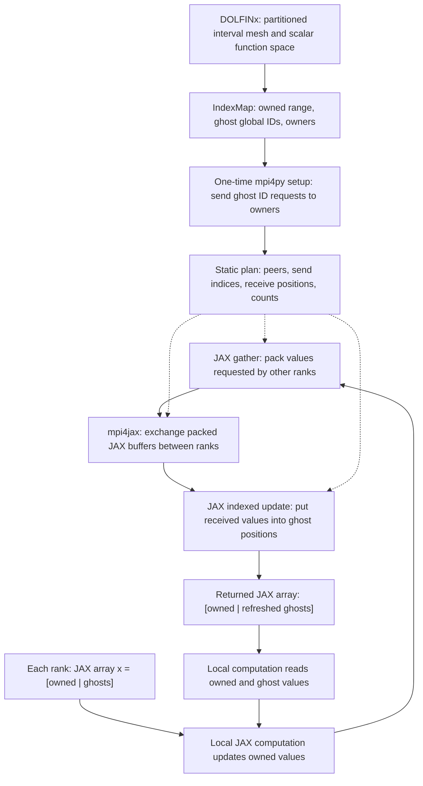

```mermaid
flowchart TD
    A["DOLFINx: partitioned interval mesh and scalar function space"]
    B["IndexMap: owned range, ghost global IDs, owners"]
    C["One-time mpi4py setup: send ghost ID requests to owners"]
    D["Static plan: peers, send indices, receive positions, counts"]
    A --> B --> C --> D

    E["Each rank: JAX array x = [owned | ghosts]"]
    F["Local JAX computation updates owned values"]
    G["JAX gather: pack values requested by other ranks"]
    H["mpi4jax: exchange packed JAX buffers between ranks"]
    I["JAX indexed update: put received values into ghost positions"]
    J["Returned JAX array: [owned | refreshed ghosts]"]
    K["Local computation reads owned and ghost values"]

    E --> F --> G --> H --> I --> J --> K
    D -.-> G
    D -.-> H
    D -.-> I
    K --> F
```