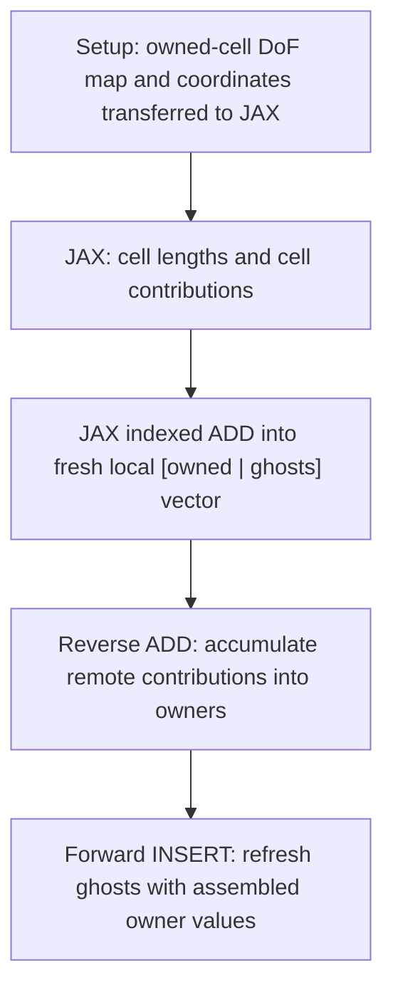

# Experiments

Standalone explorations kept outside the main examples and essential test suite.
Run commands from the repository root.


## Device-side assembly example

`mpirun -n 4 python experiments/assembly.py` assembles the P1 load vector
`b_i = integral(phi_i dx)` on an eight-cell unit interval. Following DOLFINx's
cell assembly, only owned cells contribute; including ghost cells would double
count integrals. Connectivity and coordinates are transferred once at setup.
All subsequent numerical computation occurs in JAX, including cell lengths,
cell loads `[h/2, h/2]`, and indexed local accumulation.



The complete numerical pipeline runs within one `jax.jit`. The example executes
one assembly and compares all three vector stages against independent DOLFINx
`fem.assemble_vector`, reverse ADD and forward scatter. It also checks the exact
load formula (1/16 at endpoints, 1/8 at interior nodes) and an owned-entry global
sum of 1. An optional MPI test exercises eager and compiled execution.
Every new assembly starts from zeros: reverse does not clear contributions,
and refreshed ghosts must not be reused as contributions for another assembly.

Run the optional eager/JIT check explicitly:

```bash
mpirun -n 4 python -m pytest experiments/test_assembly.py
```
